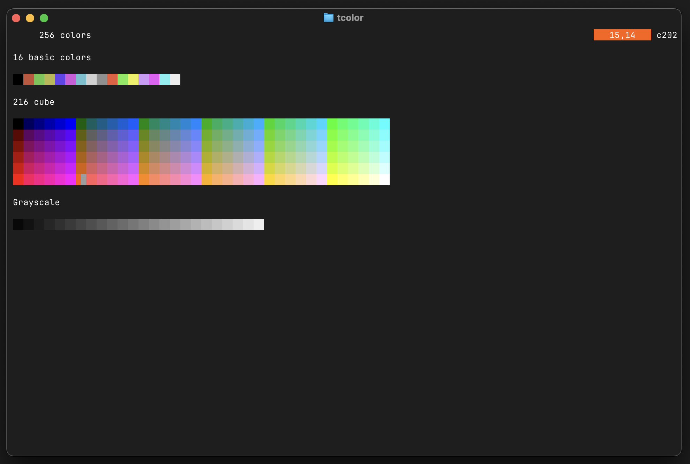
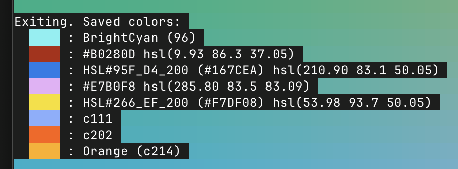

[](https://pkg.go.dev/fortio.org/tcolor)
[](https://goreportcard.com/report/fortio.org/tcolor)
[](https://github.com/fortio/tcolor/actions/workflows/include.yml)
# tcolor
Terminal Color exploration using the [Ansipixels](https://pkg.go.dev/fortio.org/terminal/ansipixels) TUI go library.

`tcolor` is a simple terminal/TUI color picker/chooser/explorer.

Multiple modes (space bar and arrows to switch) from basic named colors, to 256 indexed:



Hue, Saturation, Lightness:


[OKLCH](https://oklch.com/) mode:


3 RGB screens, eg:


Saved (clicked) colors on exit (and similar if you pass in colors as arguments):



## Install
You can get the binary from [releases](https://github.com/fortio/tcolor/releases)

Or just run
```
CGO_ENABLED=0 go install fortio.org/tcolor@latest  # to install (in ~/go/bin typically) or just
CGO_ENABLED=0 go run fortio.org/tcolor@latest  # to run without install
```

or even
```
docker run -ti fortio/tcolor # but that's obviously slower
```

or
```
brew install fortio/tap/tcolor
```

## Run

With no arguments/only flags:
### Interactive

Currently 5 interactive screens (3 sub-screens in RGB):
- Basic 16 colors
- 256 Colors
- 24 bits Hue Saturation Luminance (HSL)
- OKLCH mode
- 24 bits RGB where space bar change which component is set up/down with arrows. Space bar to switch component.

Up and down arrows to increase luminance on the HSL screen, the third color component on the RGB screen.

Move the mouse for color details.

Click to copy the color code to the clipboard. They are also saved to be printed on exit (Q).
If using right clicking, the web HSL is copied instead of the #RRGGBB format.
If using a modifier while clicking, the web OKLCH is copied instead of rgb format.


### Color decoding

If you pass arguments to `tcolor` they will be decoded as colors and previewed, with various formats like

```sh
c101 # 101th color of the 256 palette
red  # Name from the 16th basic color (+ Orange 17th named color), see list in first screen.
RRGGBB # 6 hex RGB
0.1,.4,.5 # float [0-1] hsl color
hsl(300 40 50) # web css HSL format (degrees percentSaturation percentLightness)
HSL#FFF_FF_200 # full resolution hex hsl (000-FFF hue, 00-FF saturation, 000-3FF lightness)
oklch(0.53 0.12 243) # web oklch color space https://oklch.com/#0.53,0.12,243,100
# and more...
```

```sh
tcolor help
```
```
flags:
  -rounding int
        Number of digits to round HSL values for WebHSL output/copy paste (negative for default full precision) (default -1)
  -truecolor
        Use true color (24-bit RGB) instead of 8-bit ANSI colors (default is true if COLORTERM is set) (default true)
```
